# Project — Traffic Vehicle Classification
## Initial Project Report

**Report status:** This report has been prepared based on the data, code, and recorded results.  
**Evaluation basis:** The model results in this report are primarily based on the **Validation** set, and the Test set has not yet been used for final evaluation.

---

## 1. Project Introduction

The goal of the project is to develop an image classification system for identifying vehicle types from cropped traffic-camera images.

At this stage, the project has moved beyond data preparation, and several model families have been investigated, including a custom CNN, a CNN based on Depthwise Separable Convolution, and several pretrained models including ResNet18 and MobileNetV3.

The experiments have not focused only on Accuracy; Precision, Recall, F1, and error analysis have also been examined in the evaluation stage.

---

# 2. Dataset and Data Preparation

## 2.1 Classes

The dataset contains 8 classes:

| ID | Class |
|---:|---|
| 0 | `ambulance` |
| 1 | `autobus` |
| 2 | `kamyun` |
| 3 | `kamyunet` |
| 4 | `minibus` |
| 5 | `savari` |
| 6 | `taxi` |
| 7 | `vanet` |

The class mapping in `ImageFolder` was checked between train and validation, and consistency was asserted.

some of the images from all the 8 classes we have

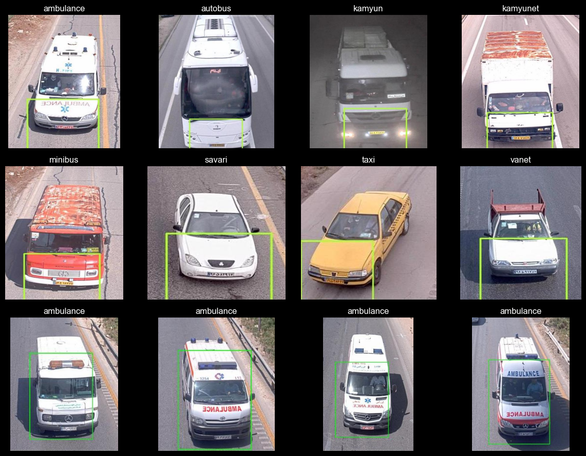
---

## 2.2 Initial Data Quality Check

During the EDA stage, the initial train data were examined.

Initial number of train images:

**3736 images**

Class distribution in this set:

| Class | Count |
|---|---:|
| ambulance | 407 |
| autobus | 520 |
| kamyun | 487 |
| kamyunet | 564 |
| minibus | 461 |
| savari | 562 |
| taxi | 535 |
| vanet | 200 |
| **Total** | **3736** |

During the image integrity check:

- No unreadable files were found.
- No unusual image with width or height below 50 pixels was observed.
- More than 2000 different combinations of image dimensions were found; therefore, the original images did not have a fixed input size.
- Image dimensions before resizing were varied, and the EDA recorded an average width of approximately 255.9 and an average height of approximately 318.3 pixels.

---

## 2.3 Duplicate Check and Split

Image hashing(Hash MD5) was used to check for duplicate images.

No duplicate hash was identified in the examined collection.

The train set was then split into train and validation subsets using:

- `test_size=0.20`
- `stratify=class`
- `random_state=42`

Result:

| Split | Count |
|---|---:|
| Train | 2988 |
| Validation | 748 |
| Total | 3736 |

Class distribution after the split:

| Class | Train | Validation |
|---|---:|---:|
| ambulance | 326 | 81 |
| autobus | 416 | 104 |
| kamyun | 389 | 98 |
| kamyunet | 451 | 113 |
| minibus | 369 | 92 |
| savari | 449 | 113 |
| taxi | 428 | 107 |
| vanet | 160 | 40 |
| **Total** | **2988** | **748** |

The train and validation image hashes also had no overlap.

---

# 3. Image Transform and DataLoader

## 3.1 Baseline Transform

The following transform was used for the base CNN:

1. Resize to `224 × 224`
2. Convert to Tensor
3. Normalize using:

```text
mean = (0.5, 0.5, 0.5)
std  = (0.5, 0.5, 0.5)
```

---

## 3.2 Augmented Transform

The basic augmentation version included:

```text
Resize(224, 224)
RandomHorizontalFlip(p=0.5)
ToTensor()
Normalize(mean=0.5, std=0.5)
```

A stronger augmentation configuration was also tested in another experiment, including:

- Random Horizontal Flip
- Gaussian Blur
- Random Erasing

---

## 3.3 DataLoader

Main DataLoader parameters:

```text
batch_size = 32
num_workers = 0
seed = 42
```

Training used `shuffle=True`, while validation used `shuffle=False`.

---

# 4. SmallCNN Model

The main initial model was a custom CNN named `SmallCnn`.

Overall structure:

```text
Input: 3 × 224 × 224

Block 1:
Conv 3 → 32
BatchNorm
ReLU
Conv 32 → 32
BatchNorm
ReLU
Pooling

Block 2:
Conv 32 → 64
BatchNorm
ReLU
Conv 64 → 64
BatchNorm
ReLU
Pooling

Block 3:
Conv 64 → 128
BatchNorm
ReLU
Conv 128 → 128
BatchNorm
ReLU
Pooling

Block 4:
Conv 128 → 256
BatchNorm
ReLU

AdaptiveAvgPool2d(1)
Flatten
Dropout
Linear(256 → 8)
```

Number of parameters:

```text
Total parameters     = 585,640
Trainable parameters = 585,640
```

The base CNN was trained using `Adam` with:

```text
learning rate = 0.001
epochs = 50
```

The best checkpoint was saved based on the highest Validation Accuracy.

---

# 5. Baseline CNN

## Configuration

```text
Model      : SmallCNN
Dropout    : 0.0
Pooling    : MaxPool
Optimizer  : Adam
LR         : 0.001
Epochs     : 50
Batch size : 32
Seed       : 42
Loss       : CrossEntropyLoss
```

### Training Result

The highest recorded Validation Accuracy was:

```text
Epoch 50
Train Accuracy: 99.9%
Validation Accuracy: 93.3%
Validation Loss: 0.277
```

Validation evaluation of the checkpoint:

```text
Accuracy        = 93.32%
Macro Precision = 93.67%
Macro Recall    = 91.52%
Macro F1        = 92.29%
```

Per-class performance:

| Class | Precision | Recall | F1 |
|---|---:|---:|---:|
| ambulance | 1.00 | 0.95 | 0.97 |
| autobus | 0.94 | 0.99 | 0.96 |
| kamyun | 0.96 | 0.82 | 0.88 |
| kamyunet | 0.84 | 0.98 | 0.91 |
| minibus | 1.00 | 0.90 | 0.95 |
| savari | 0.90 | 0.97 | 0.94 |
| taxi | 0.97 | 0.98 | 0.98 |
| vanet | 0.88 | 0.72 | 0.79 |

This result shows that class-level performance is not uniform in the baseline, with `vanet` and `kamyun` showing relatively lower Recall.

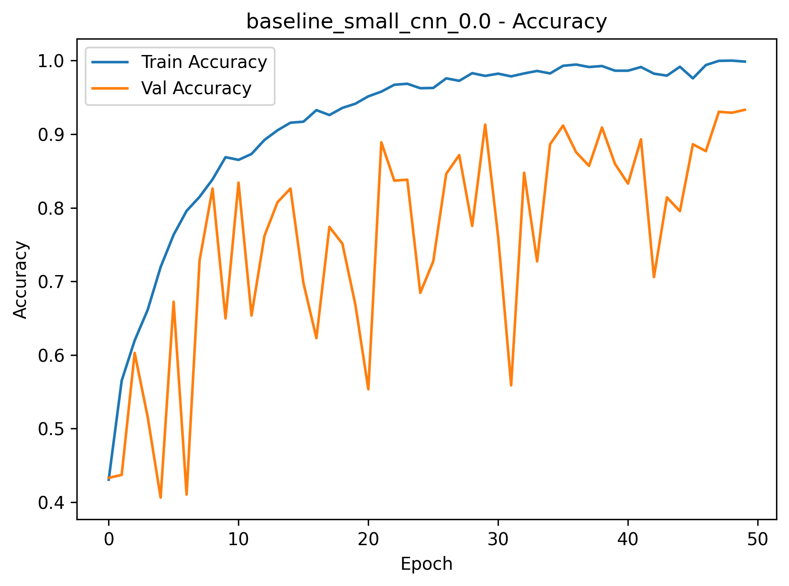
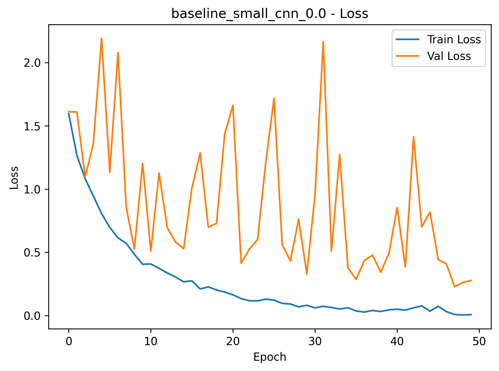
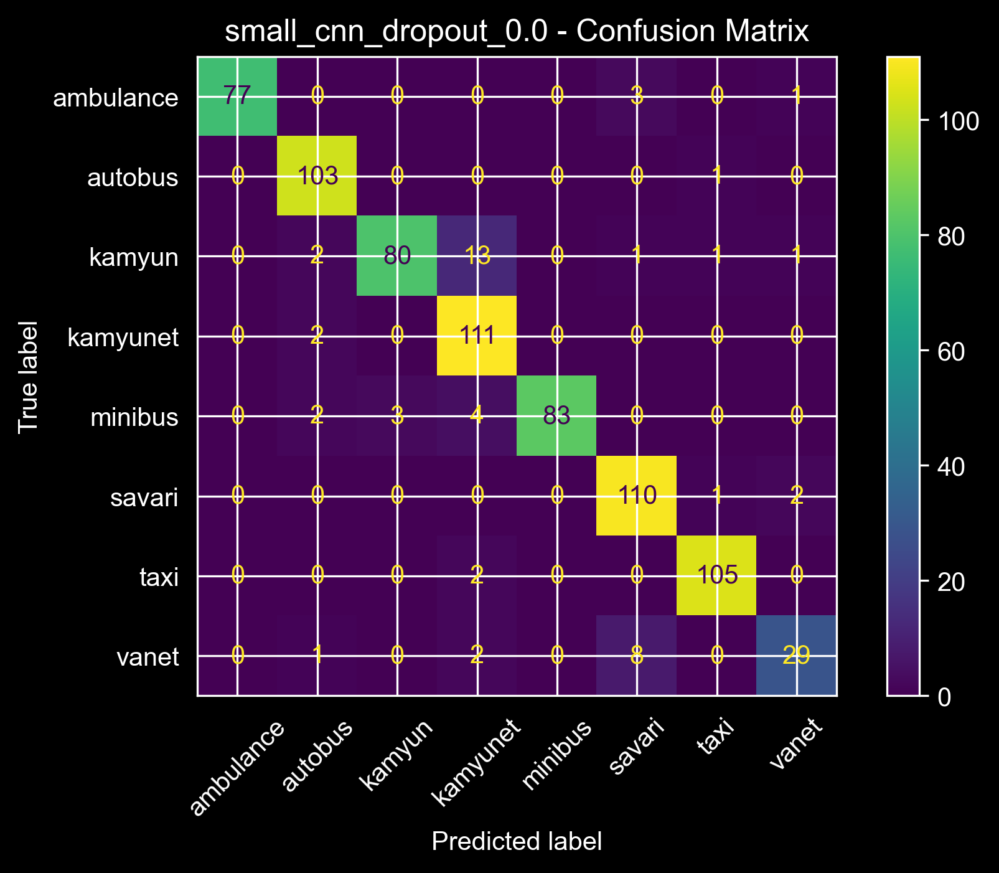
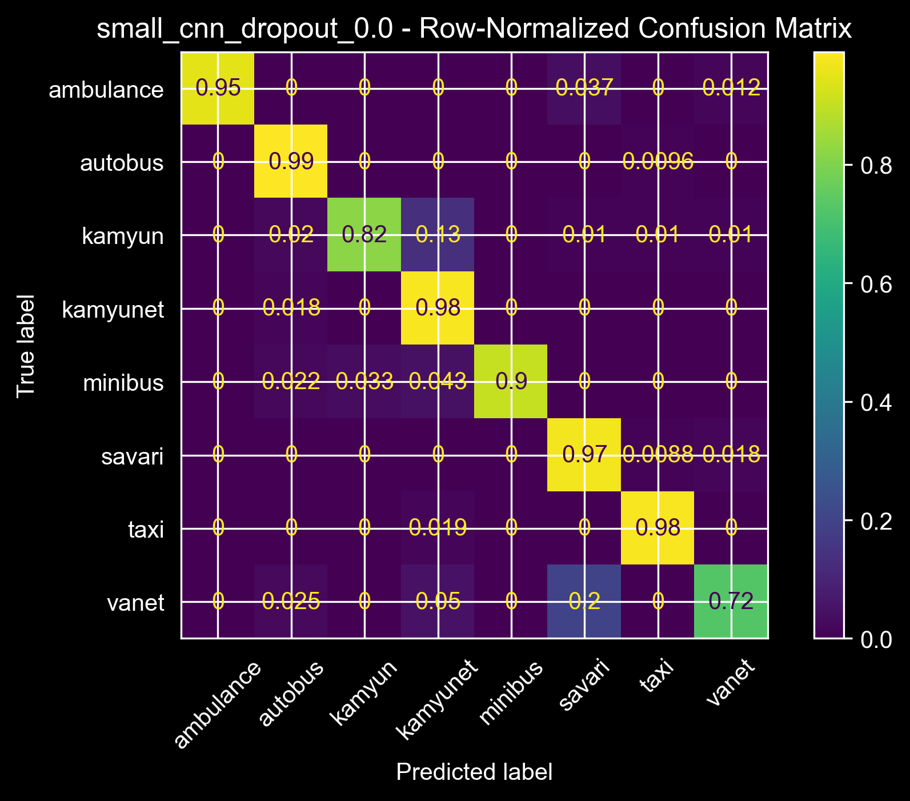

---

# 6. Augmentation Experiment

## 6.1 RandomHorizontalFlip

To examine the effect of augmentation, only Random Horizontal Flip with probability 0.5 was added.

Best epoch:

| Metric | Result |
|---|---:|
| Best Epoch | 38 |
| Train Accuracy | 98.6% |
| Validation Accuracy | 92.0% |
| Validation Loss | 0.293 |


```text
Accuracy        = 92.0%
train Accuracy  = 98.6%
Macro Precision = 91.82%
Macro Recall    = 90.45%
Macro F1        = 90.99%
```

Per-class performance:

| Class | Precision | Recall |   F1 |
|---|----------:|-------:|-----:|
| ambulance |      1.00 |   0.93 | 0.96 |
| autobus |      0.97 |   0.93 | 0.95 |
| kamyun |      0.89 |   0.87 | 0.88 |
| kamyunet |      0.88 |   0.92 | 0.90 |
| minibus |      0.86 |   0.96 | 0.91 |
| savari |      0.89 |   0.96 | 0.93 |
| taxi |      0.99 |   0.94 | 0.97 |
| vanet |      0.85 |   0.72 | 0.78 |

At epoch 50, Validation Accuracy decreased to 74.7%, while Training Accuracy remained around 98.7%. Therefore, the train-validation gap increased during the later stage of training.

---

## 6.2 Stronger Augmentation

Another experiment used:

```text
RandomHorizontalFlip
GaussianBlur
RandomErasing
```

Result:

| Metric | Result |
|---|---:|
| Best Epoch | 49 |
| Train Accuracy | 98.7% |
| Validation Accuracy | 92.4% |
| Validation Loss | 0.297 |
| Final Validation Accuracy | 87.6% |

---

# 7. Dropout Experiment

Three configurations were examined:

```text
p = 0.0
p = 0.3
p = 0.5
```

Results:

| Dropout | Best Epoch | Best Val Accuracy | Best Val Loss | Train Accuracy |
|---:|---:|---:|---:|---------------:|
| 0.0 | 50 | 93.3% | 0.277 |          99.9% |
| 0.3 | 44 | 92.5% | 0.253 |          98.9% |
| 0.5 | 44 | 92.6% | 0.233 |          98.1% |

Validation metrics:

| Dropout | Macro Precision | Macro Recall | Macro F1 |
|---:|---:|---:|---:|
| 0.0 | 93.67% | 91.52% | 92.29% |
| 0.3 | 91.92% | 91.67% | 91.57% |
| 0.5 | 92.78% | 90.67% | 91.48% |


Dropout:0.0

Per-class performance:

| Class             |  Precision |     Recall |         F1 |
| ----------------- | ---------: | ---------: | ---------: |
| ambulance         |       1.00 |       0.95 |       0.97 |
| autobus           |       0.94 |       0.99 |       0.96 |
| kamyun            |       0.96 |       0.82 |       0.88 |
| kamyunet          |       0.84 |       0.98 |       0.91 |
| minibus           |       1.00 |       0.90 |       0.95 |
| savari            |       0.90 |       0.97 |       0.94 |
| taxi              |       0.97 |       0.98 |       0.98 |
| vanet             |       0.88 |       0.72 |       0.79 |
| **Macro Average** | **0.9367** | **0.9152** | **0.9229** |

Dropout:0.3

Per-class performance:

| Class             |  Precision |     Recall |         F1 |
| ----------------- | ---------: | ---------: | ---------: |
| ambulance         |       1.00 |       0.95 |       0.97 |
| autobus           |       0.93 |       0.96 |       0.94 |
| kamyun            |       0.97 |       0.77 |       0.86 |
| kamyunet          |       0.90 |       0.95 |       0.92 |
| minibus           |       0.86 |       0.96 |       0.91 |
| savari            |       0.92 |       0.96 |       0.94 |
| taxi              |       0.99 |       0.97 |       0.98 |
| vanet             |       0.79 |       0.82 |       0.80 |
| **Macro Average** | **0.9192** | **0.9167** | **0.9157** |


Dropout:0.5

Per-class performance:

| Class             |  Precision |     Recall |         F1 |
| ----------------- | ---------: | ---------: | ---------: |
| ambulance         |       1.00 |       0.95 |       0.97 |
| autobus           |       0.92 |       0.95 |       0.93 |
| kamyun            |       0.88 |       0.88 |       0.88 |
| kamyunet          |       0.90 |       0.92 |       0.91 |
| minibus           |       0.96 |       0.92 |       0.94 |
| savari            |       0.90 |       0.98 |       0.94 |
| taxi              |       0.98 |       0.97 |       0.98 |
| vanet             |       0.90 |       0.68 |       0.77 |
| **Macro Average** | **0.9278** | **0.9067** | **0.9148** |


In the current data, increasing Dropout did not produce a higher Best Validation Accuracy than the baseline.

---

# 8. Pooling Experiment

In this experiment, Max Pooling was replaced with Average Pooling.

Results:

| Pooling | Best Epoch | Best Val Accuracy | Best Val Loss | Train Accuracy |
|---|---:|---:|---:|---:|
| Max | 50 | 93.3% | 0.277 | 99.9%|
| Average | 47 | 91.6% | 0.330 | 97.7%|

For Average Pooling:

```text
Accuracy        = 91.58%
train Accuracy  = 97.7%
Macro Precision = 92.38%
Macro Recall    = 89.07%
Macro F1        = 90.05%
```

Per-class performance:

| Class     | Precision | Recall |   F1 |
| --------- | --------: | -----: | ---: |
| ambulance |      0.94 |   0.96 | 0.95 |
| autobus   |      0.92 |   0.96 | 0.94 |
| kamyun    |      0.94 |   0.80 | 0.86 |
| kamyunet  |      0.85 |   0.94 | 0.89 |
| minibus   |      0.91 |   0.91 | 0.91 |
| savari    |      0.88 |   0.99 | 0.93 |
| taxi      |      0.99 |   0.96 | 0.98 |
| vanet     |      0.96 |   0.60 | 0.74 |

---

# 9. Weight Decay Experiment

Two configurations were examined:

```text
weight_decay = 0
weight_decay = 1e-4
```

`AdamW` was used for this experiment.

Results:

| Weight Decay | Best Epoch | Best Val Accuracy | Best Val Loss | Train Accuracy |
|---:|---:|---:|---:|---:|
| 0 | 50 | 93.3% | 0.277 |99.9%|
| 1e-4 | 50 | 93.4% | 0.243 |100.0%|

For `weight_decay=1e-4` on validation:

```text
Accuracy        = 93.45%
Train Accuracy  = 100.0%
Macro Precision = 93.50%
Macro Recall    = 92.10%
Macro F1        = 92.68%
```
Per-class performance:

| Class             |  Precision |     Recall |         F1 |
| ----------------- | ---------: | ---------: | ---------: |
| ambulance         |       1.00 |       0.95 |       0.97 |
| autobus           |       0.95 |       0.93 |       0.94 |
| kamyun            |       0.91 |       0.88 |       0.90 |
| kamyunet          |       0.92 |       0.96 |       0.94 |
| minibus           |       0.95 |       0.91 |       0.93 |
| savari            |       0.87 |       0.99 |       0.93 |
| taxi              |       0.99 |       0.97 |       0.98 |
| vanet             |       0.89 |       0.78 |       0.83 |
| **Macro Average** | **0.9350** | **0.9210** | **0.9268** |

---

# 10. Learning Rate Scheduling

Two schedulers were tested:

- `StepLR`
- `ReduceLROnPlateau`

## StepLR

Configuration:

```text
initial LR = 0.001
step_size = 10
gamma = 0.1
```

Result:

| Metric | Result |
|---|---:|
| Best Epoch | 27 |
| Best Val Accuracy | 90.8% |
| Best Val Loss | 0.324 |
| Train Accuracy | 95.5%|

Validation metrics:

```text
Macro Precision = 90.41%
Macro Recall    = 87.75%
Macro F1        = 88.58%
```
Per-class performance:

| Class             |  Precision |     Recall |         F1 |
| ----------------- | ---------: | ---------: | ---------: |
| ambulance         |       0.97 |       0.95 |       0.96 |
| autobus           |       0.90 |       0.91 |       0.91 |
| kamyun            |       0.90 |       0.85 |       0.87 |
| kamyunet          |       0.90 |       0.92 |       0.91 |
| minibus           |       0.93 |       0.89 |       0.91 |
| savari            |       0.82 |       1.00 |       0.90 |
| taxi              |       0.99 |       0.97 |       0.98 |
| vanet             |       0.81 |       0.53 |       0.64 |
| **Macro Average** | **0.9041** | **0.8775** | **0.8858** |

---

## ReduceLROnPlateau

Scheduler configuration:

```text
patience = 5
factor = 0.1
min_lr = 1e-6
```

Result:

| Metric | Result |
|---|-------:|
| Best Epoch |     23 |
| Best Val Accuracy |  92.5% |
| Best Val Loss |  0.250 |
| Train Accuracy |  98.2% |

Validation metrics:

```text
Macro Precision = 91.61%
Macro Recall    = 90.18%
Macro F1        = 90.72%
```
Per-class performance:

| Class             |  Precision |     Recall |         F1 |
| ----------------- | ---------: | ---------: | ---------: |
| ambulance         |       1.00 |       0.96 |       0.98 |
| autobus           |       0.96 |       0.92 |       0.94 |
| kamyun            |       0.90 |       0.87 |       0.89 |
| kamyunet          |       0.92 |       0.94 |       0.93 |
| minibus           |       0.90 |       0.93 |       0.91 |
| savari            |       0.88 |       0.99 |       0.93 |
| taxi              |       0.99 |       0.97 |       0.98 |
| vanet             |       0.78 |       0.62 |       0.69 |
| **Macro Average** | **0.9161** | **0.9018** | **0.9072** |

---

# 11. Simulated Imbalance

Because the current train set is not perfectly balanced, a controlled imbalanced training subset was created to study sampling.

Retained sample counts:

| Class ID | Class | Retained |
|---:|---|---:|
| 0 | ambulance | 126 |
| 1 | autobus | 216 |
| 2 | kamyun | 189 |
| 3 | kamyunet | 451 |
| 4 | minibus | 169 |
| 5 | savari | 449 |
| 6 | taxi | 428 |
| 7 | vanet | 160 |
| | **Total** | **2188** |

The random seed was 42.

---

# 12. Standard Sampling on the Imbalanced Set

The first configuration used:

```python
DataLoader(
    ...,
    batch_size=32,
    shuffle=True
)
```

Result:

| Metric | Result |
|---|-------:|
| Best Epoch |     40 |
| Best Val Accuracy |  89.6% |
| Final Val Accuracy |  84.9% |
| Best Val Loss |  0.356 |
| Train Accuracy |  99.4% |

Validation metrics:

```text
Macro Precision = 88.25%
Macro Recall    = 88.31%
Macro F1        = 88.09%
```
Per-class performance:

| Class             |  Precision |     Recall |         F1 |
| ----------------- | ---------: | ---------: | ---------: |
| ambulance         |       0.97 |       0.89 |       0.93 |
| autobus           |       0.93 |       0.85 |       0.88 |
| kamyun            |       0.93 |       0.82 |       0.87 |
| kamyunet          |       0.90 |       0.92 |       0.91 |
| minibus           |       0.82 |       0.92 |       0.87 |
| savari            |       0.88 |       0.95 |       0.91 |
| taxi              |       0.97 |       0.97 |       0.97 |
| vanet             |       0.65 |       0.75 |       0.70 |
| **Macro Average** | **0.8825** | **0.8831** | **0.8809** |

---

# 13. BalancedBatchSampler

For the second configuration, a `BalancedBatchSampler` was implemented.

With `batch_size=32` and 8 classes:

```text
32 / 8 = 4
```

Therefore, exactly 4 samples from each class were placed in every batch.

Example verification:

```text
ambulance : 4
autobus   : 4
kamyun    : 4
kamyunet  : 4
minibus   : 4
savari    : 4
taxi      : 4
vanet     : 4
```

Training result:

| Metric | Result |
|---|-------:|
| Best Epoch |     46 |
| Best Val Accuracy |  88.5% |
| Final Val Accuracy |  88.5% |
| Best Val Loss |  0.456 |
| Train Accuracy | 100.0% |

Validation metrics:

```text
Macro Precision = 87.02%
Macro Recall    = 87.50%
Macro F1        = 87.18%
```
Per-class performance:

| Class             |  Precision |     Recall |         F1 |
| ----------------- | ---------: | ---------: | ---------: |
| ambulance         |       0.91 |       0.91 |       0.91 |
| autobus           |       0.88 |       0.88 |       0.88 |
| kamyun            |       0.83 |       0.81 |       0.82 |
| kamyunet          |       0.88 |       0.88 |       0.88 |
| minibus           |       0.90 |       0.83 |       0.86 |
| savari            |       0.91 |       0.95 |       0.93 |
| taxi              |       0.96 |       0.97 |       0.97 |
| vanet             |       0.67 |       0.78 |       0.72 |
| **Macro Average** | **0.8702** | **0.8750** | **0.8718** |

---

# 14. Cross Entropy vs. BCE

For the Loss Function comparison, architecture and other conditions were kept fixed.

## Cross Entropy

For this task, the model outputs an 8-dimensional logit vector and the class is selected using `argmax`.

Baseline:

```text
Macro Precision = 93.67%
Macro Recall    = 91.52%
Macro F1        = 92.29%
```

---

## BCEWithLogitsLoss

For this experiment, the target was converted to one-hot float format.

Training used:

```python
BCEWithLogitsLoss()
```

and sigmoid was not applied separately before the loss.

Best epoch:

| Metric | Result |
|---|-------:|
| Best Epoch |     36 |
| Best Val Accuracy |  93.4% |
| Best Val Loss |  0.069 |
| Final Val Accuracy |  84.5% |
| Train Accuracy |  99.7% |

Validation metrics:

```text
Macro Precision = 93.10%
Macro Recall    = 92.45%
Macro F1        = 92.65%
```

Per-class performance:

| Class             |  Precision |     Recall |         F1 |
| ----------------- | ---------: | ---------: | ---------: |
| ambulance         |       1.00 |       0.89 |       0.94 |
| autobus           |       0.92 |       0.96 |       0.94 |
| kamyun            |       0.93 |       0.87 |       0.90 |
| kamyunet          |       0.90 |       0.98 |       0.94 |
| minibus           |       0.98 |       0.89 |       0.93 |
| savari            |       0.93 |       0.98 |       0.96 |
| taxi              |       0.96 |       0.97 |       0.97 |
| vanet             |       0.83 |       0.85 |       0.84 |
| **Macro Average** | **0.9310** | **0.9245** | **0.9265** |


Recorded validation confidence analysis:

```text
CE:
correct mean confidence ≈ 0.968
wrong mean confidence   ≈ 0.765

BCE:
correct mean confidence ≈ 0.927
wrong mean confidence   ≈ 0.542
```

In this experiment, BCE showed a different confidence behavior on incorrect predictions compared with CE.

---

# 15. Transfer Learning with ResNet18

## 15.1 Feature Extraction

A pretrained ResNet18 on ImageNet was used, with the backbone frozen.

Only the new 8-class classifier head was trained.

Parameter counts:

```text
Total parameters     = 11,180,616
Trainable parameters = 4,104
```

The transform corresponding to the pretrained ResNet18 weights was used:

```text
resize size = 256
crop size   = 224

mean = [0.485, 0.456, 0.406]
std  = [0.229, 0.224, 0.225]
```

Best result:

| Metric | Result |
|---|-------:|
| Best Epoch |     37 |
| Best Val Accuracy |  91.0% |
| Best Val Loss |  0.316 |
| Train Accuracy |  95.0% |

Validation metrics:

```text
Macro Precision = 91.24%
Macro Recall    = 89.70%
Macro F1        = 90.32%
```

Per-class performance:

| Class             |  Precision |     Recall |         F1 |
| ----------------- | ---------: | ---------: | ---------: |
| ambulance         |       0.96 |       0.94 |       0.95 |
| autobus           |       0.95 |       0.93 |       0.94 |
| kamyun            |       0.79 |       0.85 |       0.82 |
| kamyunet          |       0.86 |       0.85 |       0.86 |
| minibus           |       0.95 |       0.96 |       0.95 |
| savari            |       0.92 |       0.96 |       0.94 |
| taxi              |       0.96 |       0.96 |       0.96 |
| vanet             |       0.91 |       0.72 |       0.81 |
| **Macro Average** | **0.9124** | **0.8970** | **0.9032** |

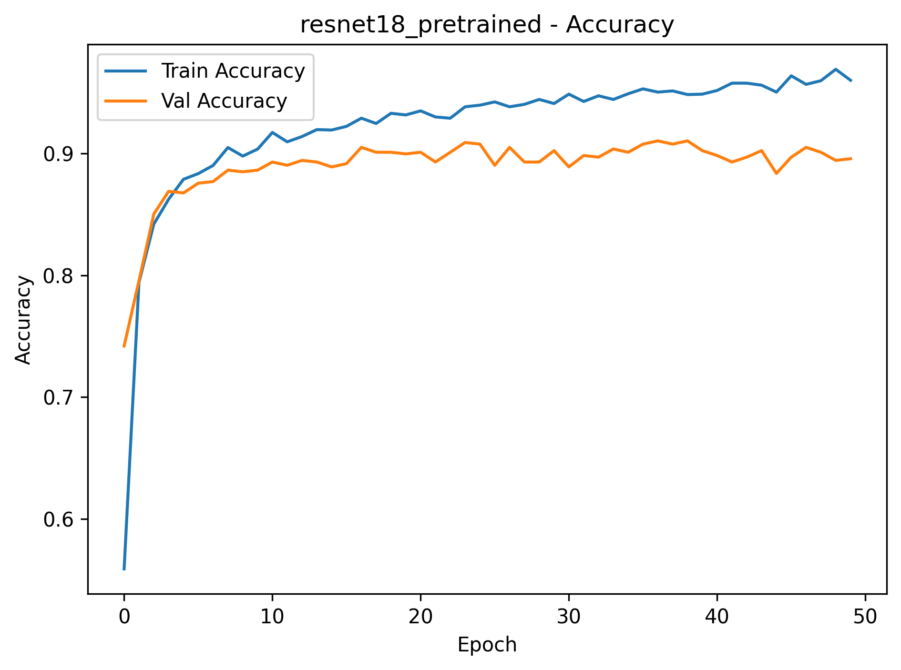
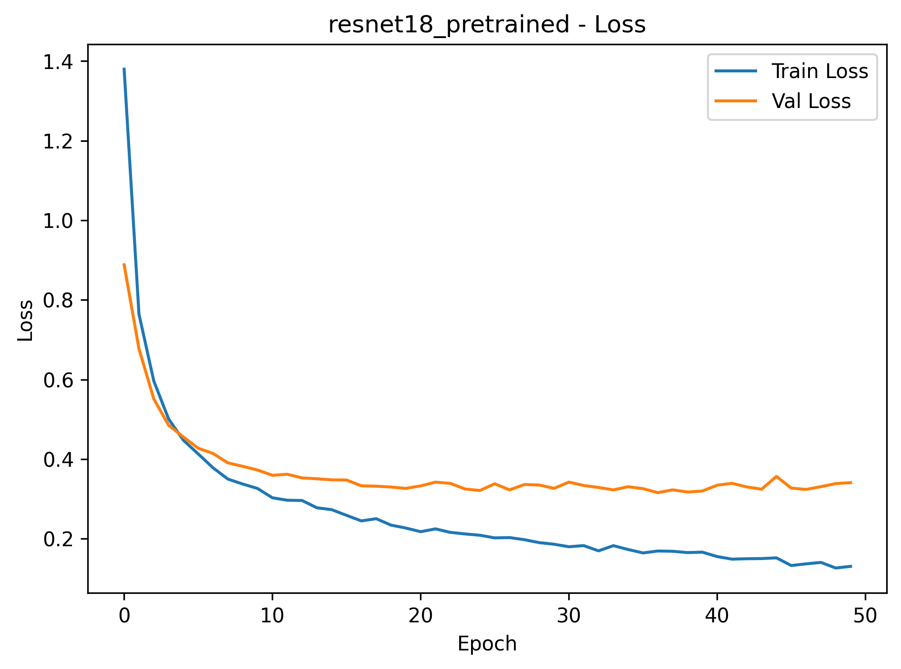
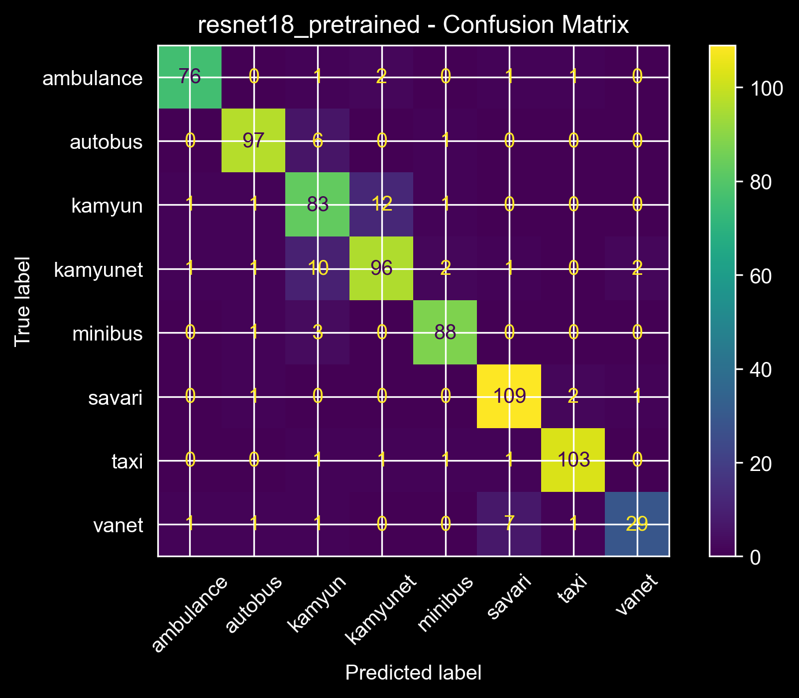
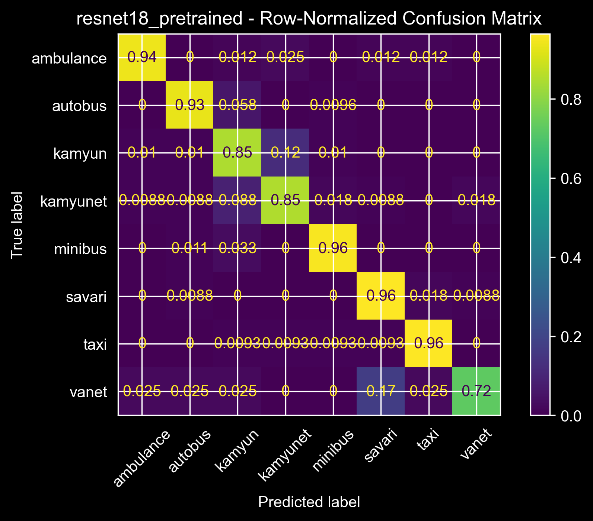
---

## 15.2 Fine-Tuning

During Fine-Tuning:

- `layer4` was unfrozen.
- The classifier was unfrozen.
- `layer4` used LR = `1e-4`.
- The classifier used LR = `1e-3`.

Trainable parameters during training:

```text
Trainable parameters = 8,397,832
Total parameters     = 11,180,616
```

Training result:

| Metric | Result |
|---|-------:|
| Best Epoch |     45 |
| Best Val Accuracy |  96.1% |
| Best Val Loss |  0.351 |
| Final Val Accuracy |  95.2% |
| Train Accuracy | 100.0% |

Checkpoint validation metrics:

```text
Accuracy        = 96.12%
Macro Precision = 96.41%
Macro Recall    = 95.21%
Macro F1        = 95.73%
```

Per-class performance:

| Class |  Precision |     Recall |         F1 |
|---|-----------:|-----------:|-----------:|
| ambulance |       0.99 |       0.96 |       0.97 |
| autobus |       0.96 |       0.98 |       0.97 |
| kamyun |       0.94 |       0.91 |       0.92 |
| kamyunet |       0.91 |       0.96 |       0.94 |
| minibus |       0.99 |       0.98 |       0.98 |
| savari |       0.96 |       1.00 |       0.98 |
| taxi |       1.00 |       0.97 |       0.99 |
| vanet |       0.97 |       0.85 |       0.91 |
| **Macro Average** | **0.9641** | **0.9521** | **0.9573** |


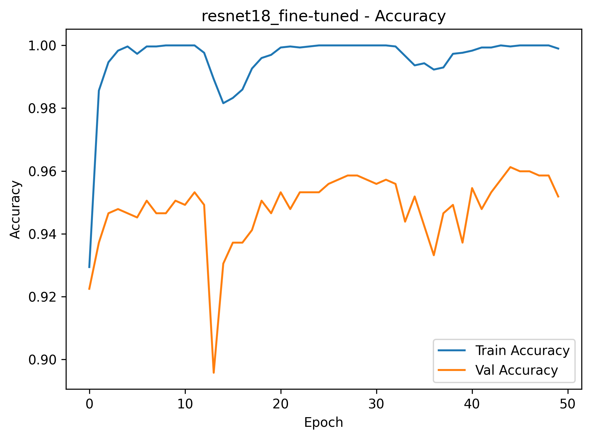
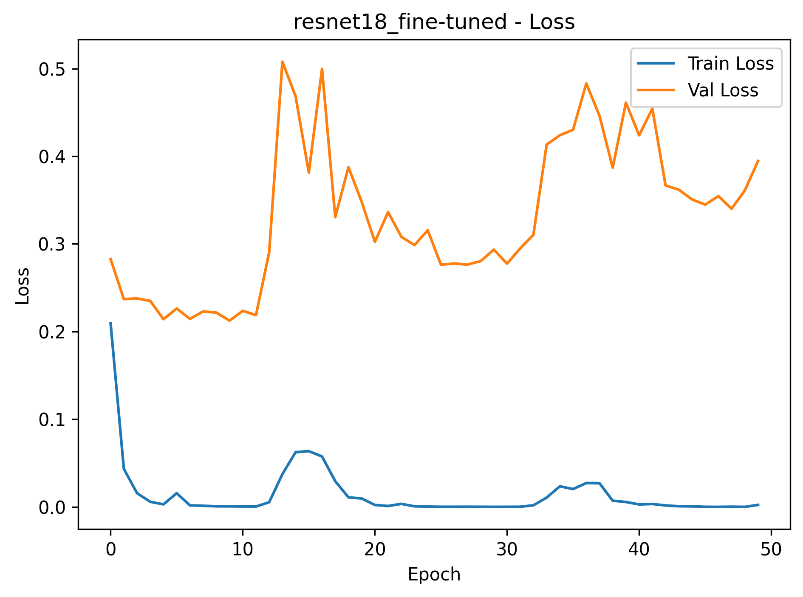
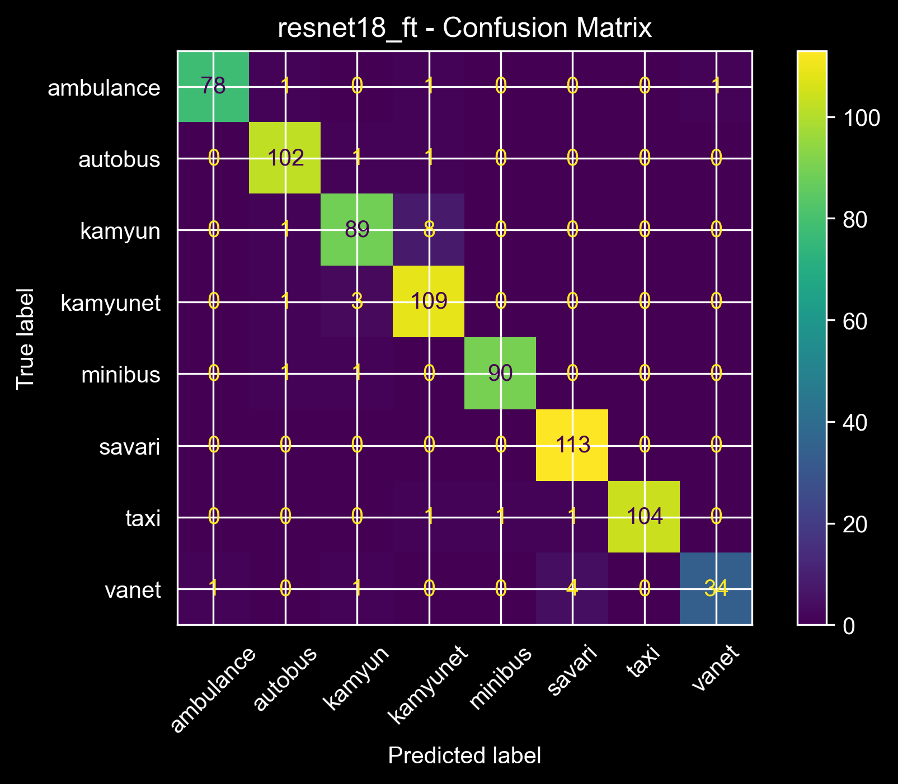
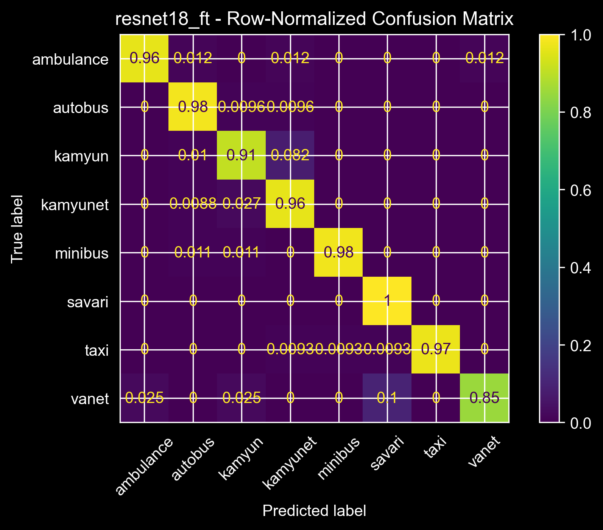
---

# 16. Error Analysis — ResNet18 Fine-Tuned

In the examined validation set:

```text
Total validation samples = 748
Misclassified samples    = 29
```

Several important error patterns were observed.

A notable portion of the errors occurred between:

```text
kamyun ↔ kamyunet
savari ↔ vanet
```

In the recorded error samples, some incorrect predictions were produced with very high confidence. For example, several `kamyun → kamyunet` errors were recorded with confidence close to 100%.

Therefore, some errors are not simply low-confidence mistakes, and in some cases the model is highly confident about an incorrect prediction.

12 images of 29 wrong predicted:

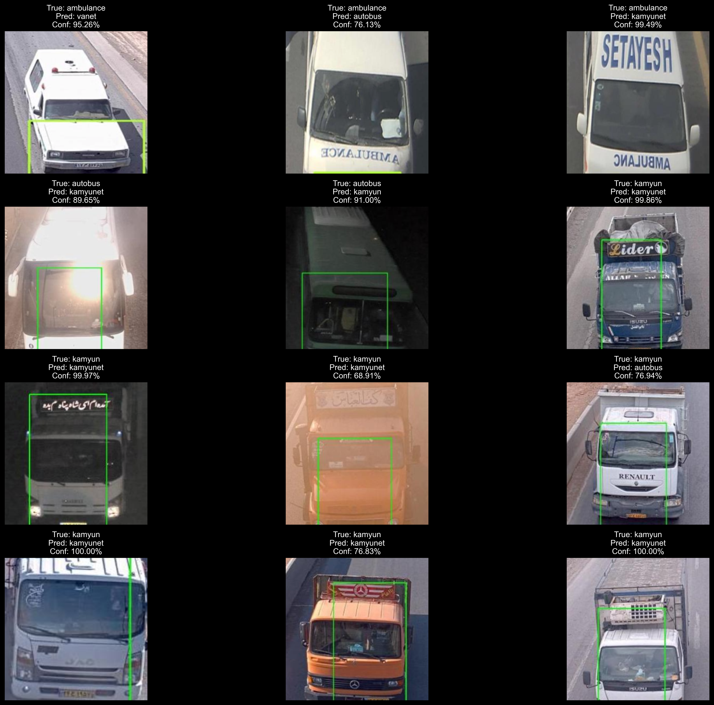


---

# 17. Mutual Confusion

Based on the Row-Normalized Confusion Matrix, the most important observed pairs were:

| Class 1 | Class 2 | Mutual Confusion |
|---|---|---:|
| kamyun | kamyunet | 0.1082 |
| savari | vanet | 0.1000 |
| ambulance | vanet | 0.0373 |
| kamyun | vanet | 0.0250 |
| autobus | kamyun | 0.0198 |
| autobus | kamyunet | 0.0185 |

The highest mutual confusion in the current results is associated with:

```text
kamyun ↔ kamyunet
```

followed by:

```text
savari ↔ vanet
```

These relationships should be examined together with the actual images and semantic meaning of the classes in later stages. A merge decision should not be made based only on the confusion matrix.

---

# 18. Confidence and Human Review

For ResNet18 Fine-Tuned, several thresholds were evaluated on validation:

| Threshold | Review Rate | Coverage | Auto Accuracy | Auto Error Rate |
|---:|---:|---:|---:|---:|
| 0.70 | 0.53% | 99.47% | 96.24% | 3.76% |
| 0.75 | 0.80% | 99.20% | 96.36% | 3.64% |
| 0.80 | 1.87% | 98.13% | 96.87% | 3.13% |
| 0.85 | 2.27% | 97.73% | 97.13% | 2.87% |
| 0.90 | 2.94% | 97.06% | 97.52% | 2.48% |
| 0.95 | 3.88% | 96.12% | 97.77% | 2.23% |

This table shows that as the threshold increases, the number of samples referred to human review increases, while the error rate on the accepted subset decreases.

final production threshold is 0.85.

---

# 19. MobileNetV3-Small

MobileNetV3-Small was used in pretrained form and its classifier was adapted for 8 classes.

Number of parameters:

```text
1,526,056
```

## ImageNet/ResNet-compatible Transform

Best epoch:

```text
Epoch 36
Validation Accuracy = 96.9%
Validation Loss     = 0.221
Train Accuracy      = 100.0%
```

## Normalization with mean/std = 0.5

In the second experiment:

```text
mean = [0.5, 0.5, 0.5]
std  = [0.5, 0.5, 0.5]
```

Result:

```text
Best Epoch        = 26
Best Val Accuracy = 97.6%
Best Val Loss     = 0.151
Train Accuracy    = 100.0%
```

Validation metrics:

```text
Macro Precision = 97.28%
Macro Recall    = 96.87%
Macro F1        = 97.06%
```

Per-class performance:

| Class             |  Precision |     Recall |         F1 |
| ----------------- | ---------: | ---------: | ---------: |
| ambulance         |       0.99 |       1.00 |       0.99 |
| autobus           |       1.00 |       1.00 |       1.00 |
| kamyun            |       0.97 |       0.94 |       0.95 |
| kamyunet          |       0.95 |       0.96 |       0.96 |
| minibus           |       1.00 |       0.99 |       0.99 |
| savari            |       0.96 |       0.99 |       0.97 |
| taxi              |       1.00 |       0.99 |       1.00 |
| vanet             |       0.92 |       0.88 |       0.90 |
| **Macro Average** | **0.9728** | **0.9687** | **0.9706** |


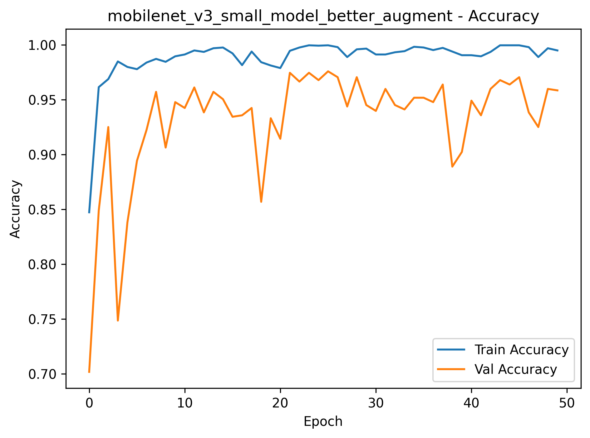
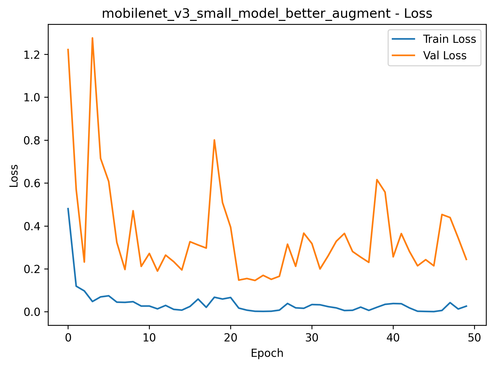
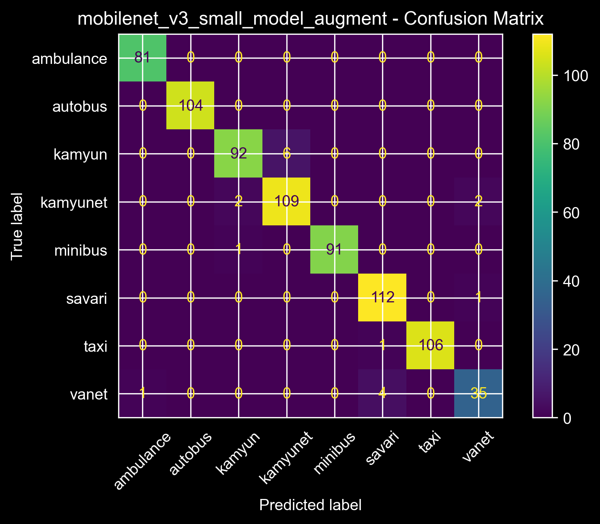
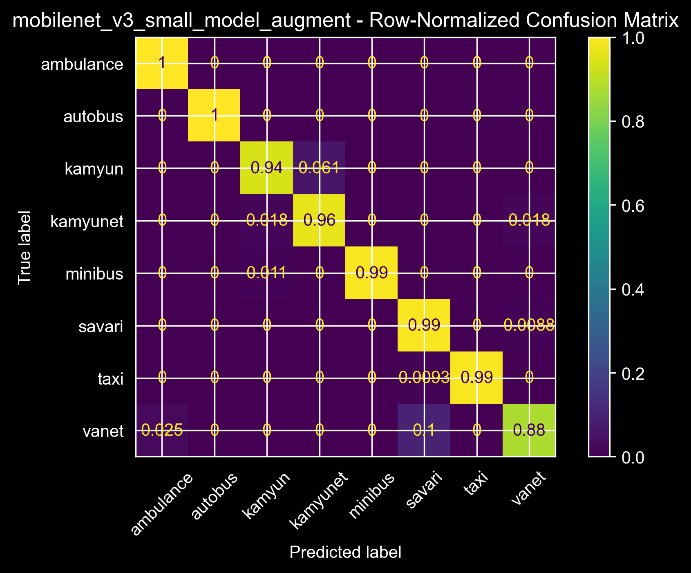

all the misclassified images:

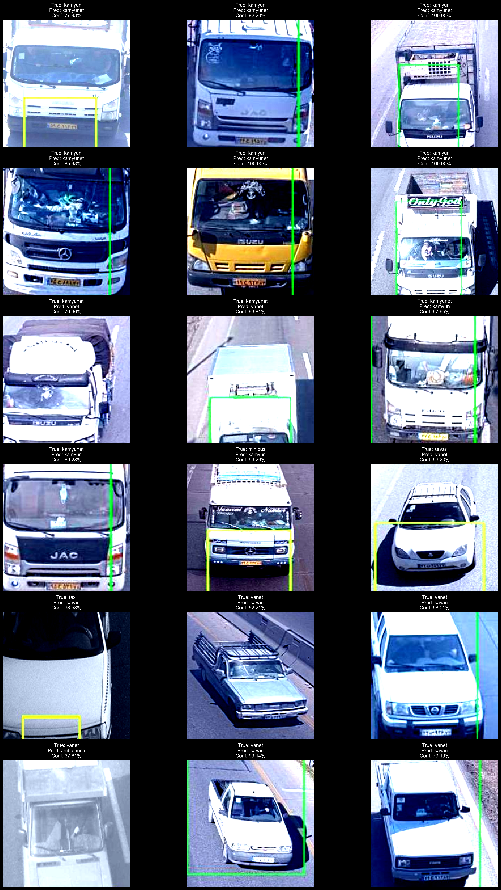

---

# 20. MobileNetV3-Large

Number of model parameters:

```text
4,212,280
```

Three training modes were examined:

1. Full Fine-Tuning
2. Head Fine-Tuning
3. Unfreeze Last 3 Blocks + Head

These modes were also run with two normalization configurations.

## ResNet-compatible Transform

| Mode | Best Epoch | Best Val Accuracy |
|---|---:|---:|
| Full | 26 | 96.5% |
| Head | 15 | 91.8% |
| Last 3 Blocks | 36 | 96.0% |

## Normalization with mean/std = 0.5

| Mode | Best Epoch | Best Val Accuracy |
|---|---:|---:|
| Full | 29 | 97.5% |
| Head | 50 | 91.0% |
| Last 3 Blocks | 29 | 97.1% |

For `Last 3 Blocks` with normalization equal to 0.5:

```text
Best Epoch        = 29
Best Val Accuracy = 97.1%
Best Val Loss     = 0.249
```

---

# 21. Depthwise CNN

To reduce the number of parameters, a version of the custom CNN using Depthwise Separable Convolution was implemented.

Number of parameters:

```text
73,033
```

The model was tested with two Dropout configurations.

| Dropout | Best Epoch | Best Val Accuracy |
|---:|---:|---:|
| 0.2 | 45 | 88.6% |
| 0.5 | 45 | 88.8% |

For Dropout=0.2, at epoch 50:

```text
Train Accuracy = 98.8%
Val Accuracy   = 80.1%
```

For Dropout=0.5, at epoch 50:

```text
Train Accuracy = 97.4%
Val Accuracy   = 79.0%
```

The gap between training and validation performance at the end of training indicates that continuing training after the best epoch was not beneficial for this model.

---

# 22.SmallCNN — Dropout = 0.0

In this experiment, the custom `SmallCNN` was trained with `Dropout=0.0`.
The experiment used the dataset configuration in which `vanet` and `neisan` were merged.

## Configuration

```text
Model      : SmallCNN
Dropout    : 0.0
Pooling    : MaxPool
Optimizer  : Adam
Learning Rate = 0.001
Epochs     : 50
Batch Size : 32
Seed       : 42
Loss       : CrossEntropyLoss
```

### Training Result

The highest recorded Validation Accuracy was obtained at **Epoch 42**:

| Metric               | Result |
| -------------------- | -----: |
| Best Epoch           |     42 |
| Train Accuracy       |  99.0% |
| Validation Accuracy  |  93.7% |
| Validation Loss      |  0.249 |
| Train-Validation Gap |   5.3% |

The corresponding training and validation losses were:

```text
Train Loss = 0.040
Validation Loss = 0.249
```

The final epoch produced:

```text
Epoch 50
Train Accuracy = 99.6%
Validation Accuracy = 90.7%
Validation Loss = 0.354
```

The difference between training and validation performance increased toward the end of training.

---


# 23. Summary of Main Experiment Results

| Experiment | Best Epoch | Best Val Acc. | Best Val Loss | Final Val Acc. |
|---|---:|---:|---:|---:|
| SmallCNN Baseline | 50 | 93.3% | 0.277 | 93.3% |
| Augmentation — Flip | 38 | 92.0% | 0.293 | 74.7% |
| Augmentation — Flip+Blur+Erasing | 49 | 92.4% | 0.297 | 87.6% |
| Dropout 0.3 | 44 | 92.5% | 0.253 | 83.7% |
| Dropout 0.5 | 44 | 92.6% | 0.233 | 89.6% |
| Average Pooling | 47 | 91.6% | 0.330 | 91.0% |
| Weight Decay 1e-4 | 50 | 93.4% | 0.243 | 93.4% |
| StepLR | 27 | 90.8% | 0.324 | 90.4% |
| ReduceLROnPlateau | 23 | 92.5% | 0.250 | 91.6% |
| Standard Imbalanced | 40 | 89.6% | 0.356 | 84.9% |
| BalancedBatchSampler | 46 | 88.5% | 0.456 | 88.5% |
| BCE | 36 | 93.4% | 0.069 | 84.5% |
| ResNet18 Feature Extraction | 37 | 91.0% | 0.316 | 89.6% |
| ResNet18 Fine-Tuning | 45 | 96.1% | 0.351 | 95.2% |
| MobileNetV3-Small + ImageNet transform | 36 | 96.9% | 0.221 | 95.1% |
| MobileNetV3-Small + 0.5 norm | 26 | 97.6% | 0.151 | 95.9% |
| MobileNetV3-Large Full + ImageNet transform | 26 | 96.5% | 0.165 | 95.5% |
| MobileNetV3-Large Head + ImageNet transform | 15 | 91.8% | 0.390 | 90.2% |
| MobileNetV3-Large Last 3 + ImageNet transform | 36 | 96.0% | 0.299 | 91.8% |
| MobileNetV3-Large Full + 0.5 norm | 29 | 97.5% | 0.182 | 90.2% |
| MobileNetV3-Large Head + 0.5 norm | 50 | 91.0% | 0.549 | 91.0% |
| MobileNetV3-Large Last 3 + 0.5 norm | 29 | 97.1% | 0.249 | 96.4% |
| Depthwise CNN Dropout 0.2 | 45 | 88.6% | 0.382 | 80.1% |
| Depthwise CNN Dropout 0.5 | 45 | 88.8% | 0.369 | 79.0% |

---

# 24. Current Project Status

The following components have been completed:

- EDA and Data Quality Check
- Cleaned train/validation split
- Class mapping verification
- Hash-based duplicate checking for the examined collection
- ImageFolder construction
- DataLoader construction
- CNN Baseline
- Augmentation
- Dropout
- Pooling
- Weight Decay
- Learning Rate Scheduling
- Simulated Imbalance
- BalancedBatchSampler
- Cross Entropy vs. BCE comparison
- ResNet18 Feature Extraction
- ResNet18 Fine-Tuning
- MobileNetV3-Small
- MobileNetV3-Large
- Depthwise CNN
- Precision/Recall/F1
- Confusion Matrix
- Row-Normalized Confusion Matrix
- Error Analysis
- Confidence Analysis

---

# 25. Current Limitations and Important Notes

### 25.1 Not All Experiments Are Strictly Matched

Some experiments, such as:

- MobileNetV3
- different normalization settings
- combined augmentation experiments

were performed as architecture/configuration comparisons and are not necessarily strict one-factor controlled ablations.

Therefore, the project should distinguish between:

```text
Controlled Ablation
```

and:

```text
Architecture Comparison
```

---

### 25.2 Importance of the Best Epoch

In many experiments, Validation Accuracy reached a higher value before epoch 50 and then decreased.

Therefore, the report should not rely only on the final epoch metric. The checkpoint associated with the best validation metric is the main reference for each experiment.

---

# 26. Internal Sources Used for This Report

This report was prepared using the following project artifacts:

- `01_eda.ipynb`
- `datasets.py`
- `transforms.py`
- `models.py`
- `train.py`
- `predict.py`
- `utils.py`
- `evaluation.ipynb`
- `epochs_report.ipynb`

#### The complete epoch-by-epoch records are maintained in `epochs_report.ipynb` , and this report is a condensed, presentation-ready version of those results.
#### You can see all the accuracy,loss,confusion matrix and normalized confusion matrix images in results/img folder.
